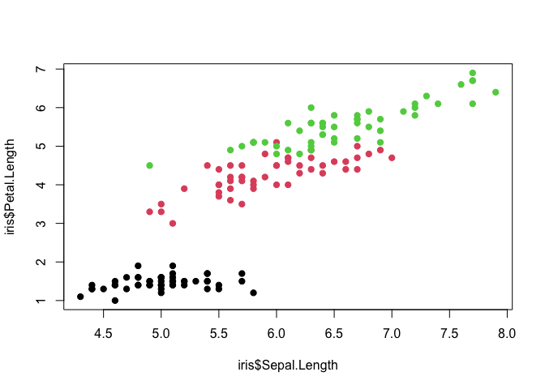

Write a review of 3-4 different articles that use data visualizations to answer a specific question

## Example 1 How do people across the world spend their time and what does this tell us about living conditions?

It is very interesting to see how people use their time across the world. One thing we all have regardless our race, financial circumstances, and location, is time that we are given 24 hours a day and 265 days per year. 
In this article, it illustrates the similarities and differences across countries. Sleep, work, eat, leisure - are the most common things we spend time on. Something we need to consider from this study is that from this study, we can learn about different lifestyle, culture, and living conditions and how it affects general we-ll being .

* What is unique or good about the visualization?
  * The bar chart makes easier to compare different proportion of time spent in different countries all in once.
  * The scatter Plot demonstrates the gender gap in leisure time. The only country that has the smallest gap is Mexico. 
  
* What could be better?
  *It would be better if there's another bar chart to display the difference between gender gap overall or by countries.

[Resource Link](https://ourworldindata.org/time-use-living-conditions)

--------------------------------------------------------------------------------

## Example 2 How rigid is the middle class in the US, really?

This example helps people to see what the middle class really is. This research takes 11,172 families as their sample that spent at least a year in the middle class. The researcher first collect annual household income data and sort all families in order of lowest to highest. Separate families into 5 groups with the same number of families in each group. These are called quintiles. Families in the 3rd or middle quintile can be thought of as being “middle income”. It shows an intrested result which is a persistent income gap exists by race.


* What is unique or good about the visualization?
  * The colors help me distinguish the objects better. I can see the highest and lowest in one second. 
  * I can see the difference between three races in one and have the clear idea of there is a Gap between different races. 
* What could be better?
  * The animation bar chart is very cool but it didn't convey the message very clearly. I was confused about the lines that displays a different thing from the bar chart. It would be better to display one variable at one time. 
  

[Resource Link](https://pudding.cool/2020/08/income/)

--------------------------------------------------------------------------------

## Example 3 Bootcamp Satisfaction Statistics: What Jobs Can You Get After a Coding Bootcamp?

Coding bootcamps are intensive, accelerated learning programs that teach beginners digital skills like Full-Stack Web Development, Data Science, Digital Marketing, UX/UI Design, Cybersecurity, and Technical Sales. This study shows the satisfaction of the students who attended bootcamps and what career they ended up with. They list 25 jobs on the chart and the satisfaction from each categories.

* What is unique or good about the visualization?
  * It is easy to see what people ended up doing in their career path after attending bootcamps. There are 19% of the graduates who become a software developer. So if you want to become a software develper, bootcamps might be a good choices.
* What could be better?
  * One thing I thing it could be better is that the most and the least satisfied chart use the same color and it might confused the reader. Use color to separate different things are important. 
[Resource Link](https://priceonomics.com/bootcamp-satisfaction-statistics-what-jobs-can-you/)

--------------------------------------------------------------------------------

## Example 4 Are we working more than ever?

Collecting the data from 1870 to 2017, gives us the answer to this questions "Are we working more than ever?". Overall, working hours for the average worker have decreased dramatically over the last 150 years. This has come from working fewer hours each day, fewer days each week, and fewer weeks each year. However there is still a large differences between countries. In the past decades, China has the highest working hour, followed by India and South Korea where Germany has steep decline over the past 150 years.  

* What is unique or good about the visualization?
  * It makes interesting to see the changes clearly in the past 150 years with diagrams. There is a trend in every country as well as the trend overall. 
* What could be better?
  * The lines are so closed in the end of the time frame, it is hard to tell whcih line is which country.It would be better to make an chart that only display the selected countries

[Resource Link](https://ourworldindata.org/working-more-than-ever)

--------------------------------------------------------------------------------

## Additional R code


```r
plot(x = iris$Sepal.Length,
     y = iris$Petal.Length, 
     col = iris$Species, pch = 19)
```

<!-- -->
