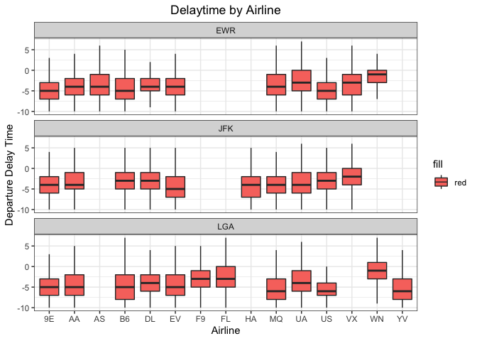
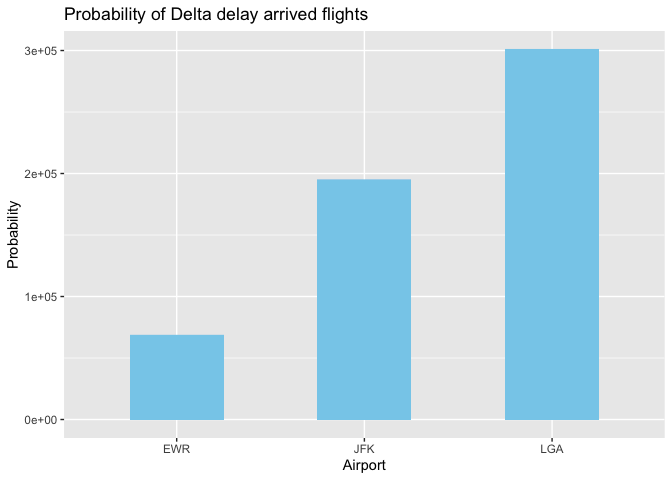

```r
library(nycflights13)
library(tidyverse)
```

```
## ── Attaching packages ─────────────────────────────────────── tidyverse 1.3.1 ──
```

```
## ✓ ggplot2 3.3.3     ✓ purrr   0.3.4
## ✓ tibble  3.1.2     ✓ dplyr   1.0.6
## ✓ tidyr   1.1.3     ✓ stringr 1.4.0
## ✓ readr   1.4.0     ✓ forcats 0.5.1
```

```
## ── Conflicts ────────────────────────────────────────── tidyverse_conflicts() ──
## x dplyr::filter() masks stats::filter()
## x dplyr::lag()    masks stats::lag()
```


# Question 1
If I am leaving before noon, which two airlines do you recommend at each airport (JFK, LGA, EWR) that will have the lowest delay time at the 75th percentile?

We can see that based on this diagram, the airlines with the lowest delay time for each airport are listed below
EWR airport: Endeavor Air (EV) and US Airways (UA) 
JFK airport: Delta Airlines (DL) and Hawaiian Airlines (HA)
LGU airport: US Airways (UA) and Mesa Airlines (YV)


```r
lowdelaytime <- flights %>%
  filter(dep_time < 1200)

#view(lowdelaytime)

ggplot(lowdelaytime, aes(x=carrier, y=dep_delay, fill = "red")) +
  theme_bw() +
  facet_wrap(. ~origin, nrow = 3) +
  geom_boxplot(outlier.shape = NA) +
  ylim(-10,7) +
  labs(x = 'Airline', y = 'Departure Delay Time', title = 'Delaytime by Airline') +
  theme(plot.title = element_text(hjust = 0.5))
```

```
## Warning: Removed 21721 rows containing non-finite values (stat_boxplot).
```

<!-- -->

## Question 2
Which origin airport is best to minimize my chances of a late arrival when I am using Delta Airlines?


```r
#get all the delta flights for each airport
flight <- flights %>% filter(carrier == 'DL')
table(flight$origin)
```

```
## 
##   EWR   JFK   LGA 
##  4342 20701 23067
```

```r
#get all the arrive delay flights 
flight <- flights %>% filter(carrier == 'DL' & arr_delay > 0)
table(flight$origin)
```

```
## 
##  EWR  JFK  LGA 
## 1725 6353 8335
```

```r
#calculate the probability of the delay flights
deltaflight <- flight %>%
  group_by(origin) %>%
  mutate(
    probability = case_when(
      origin == 'EWR' ~round(((1725/4342)*100),1),
      origin == 'JFK' ~round(((6353/20701)*100),1),
      origin == 'LGA' ~round(((8335/23067)*100),1)
    )
  )


table(deltaflight$origin)
```

```
## 
##  EWR  JFK  LGA 
## 1725 6353 8335
```

```r
ggplot(deltaflight, aes(x = origin, y = probability)) +
  geom_bar(stat="identity",fill="skyblue", width = 0.5) +
  labs(title = 'Probability of Delta delay arrived flights', x = 'Airport', y = 'Probability')
```

<!-- -->


<!-- ## Question 3 -->
<!-- Which destination airport is the worst airport for arrival time? (you decide on the metric for "worst") -->


