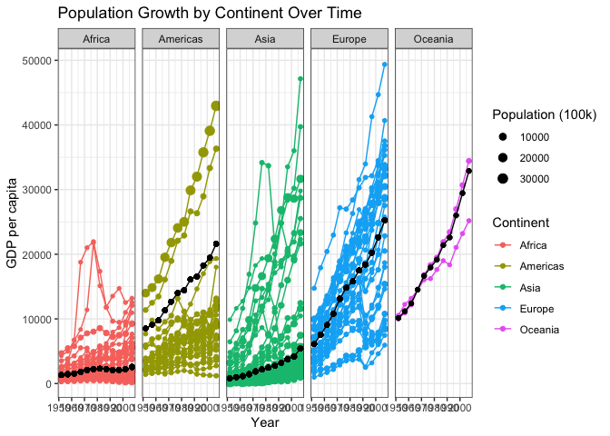
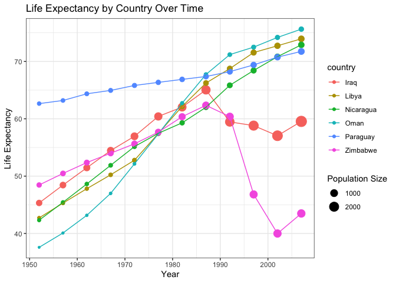

```r
# Filter out Kuwait
gap <- gapminder %>%
  filter(country != "Kuwait")

weighted.mean <- gap %>%
  arrange(desc(gdpPercap)) %>%
  mutate(wtmean = weighted.mean(gdpPercap, pop))
```


# Chart 1 Recreate


```r
chart <- gap %>%
  group_by(continent, year) %>%
  mutate(wtmean = weighted.mean(gdpPercap, pop)) %>%
  mutate(pop2 = pop/10000)

chart %>%
ggplot(aes(x= year, y= gdpPercap)) +
  geom_point(aes(color = continent, size = pop2)) +
  theme_bw() +
  scale_size_continuous(breaks = c(10000, 20000, 30000)) +
  labs(y = 'GDP per capita', x = 'Year', title = 'Population Growth by Continent Over Time', color = 'Continent', size = 'Population (100k)') +
  geom_line(aes(group = country, color = continent)) +
  geom_line(aes(x = year, y = wtmean)) +
  geom_point(aes(x = year, y = wtmean)) +
  facet_grid(. ~ continent)
```

<!-- -->


# Chart 2 Africa, Americas and Asia expectancy


```r
table(gapminder$continent)
```

```
## 
##   Africa Americas     Asia   Europe  Oceania 
##      624      300      396      360       24
```


```r
# Get data for Africa, Americas and Asia
gapminder %>% 
  filter(continent %in% c("Africa","Asia","Americas"))
```

```
## # A tibble: 1,320 x 6
##    country     continent  year lifeExp      pop gdpPercap
##    <fct>       <fct>     <int>   <dbl>    <int>     <dbl>
##  1 Afghanistan Asia       1952    28.8  8425333      779.
##  2 Afghanistan Asia       1957    30.3  9240934      821.
##  3 Afghanistan Asia       1962    32.0 10267083      853.
##  4 Afghanistan Asia       1967    34.0 11537966      836.
##  5 Afghanistan Asia       1972    36.1 13079460      740.
##  6 Afghanistan Asia       1977    38.4 14880372      786.
##  7 Afghanistan Asia       1982    39.9 12881816      978.
##  8 Afghanistan Asia       1987    40.8 13867957      852.
##  9 Afghanistan Asia       1992    41.7 16317921      649.
## 10 Afghanistan Asia       1997    41.8 22227415      635.
## # … with 1,310 more rows
```


```r
# 1. Find the countries who has the greatest and smallest change from these 3 continents


# calculate the changes
my_countries <- gapminder %>% 
  group_by(country) %>% 
  mutate(lifeExp_1952 = lifeExp[year == 1952],
         lifeExp_2007 = lifeExp[year == 2007],
         lifeExp_change = lifeExp_2007 - lifeExp_1952) %>% 
  distinct(continent, country, lifeExp_change) %>% 
  
  # find min and max for each continent
  filter(continent %in% c("Americas","Asia","Africa")) %>% 
  group_by(continent) %>% 
  arrange(continent, lifeExp_change) %>% 
  slice(1,n())  # selects the first and last row in each group
my_countries
```

```
## # A tibble: 6 x 3
## # Groups:   continent [3]
##   country   continent lifeExp_change
##   <fct>     <fct>              <dbl>
## 1 Zimbabwe  Africa             -4.96
## 2 Libya     Africa             31.2 
## 3 Paraguay  Americas            9.10
## 4 Nicaragua Americas           30.6 
## 5 Iraq      Asia               14.2 
## 6 Oman      Asia               38.1
```

```r
# get the data that contains the countries we need
new_gapminder <- gapminder %>% 
  filter(country %in% my_countries$country)
```


```r
chart2 <- new_gapminder %>%
  ggplot(aes(x = year, y = lifeExp, color = country)) +
  geom_point(aes(size = pop/10000)) +
  geom_line()+
  theme_bw() +
  labs(y = 'Life Expectancy', x = 'Year', title = 'Life Expectancy by Country Over Time', size = 'Population Size') 
  
chart2
```

<!-- -->
