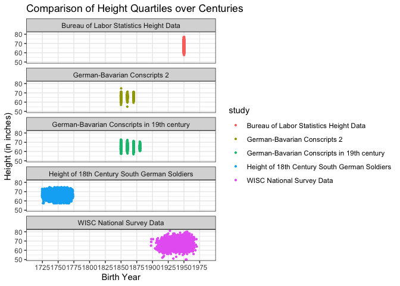
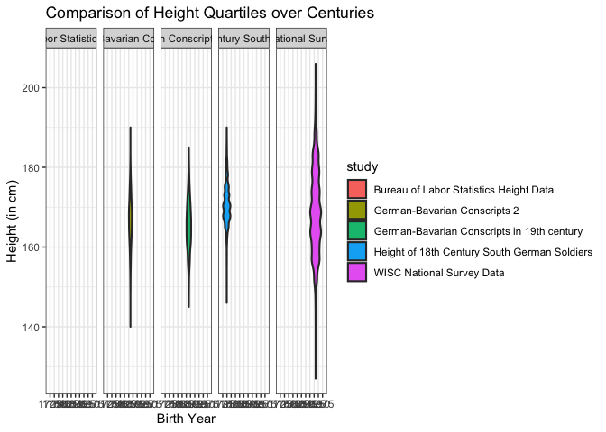
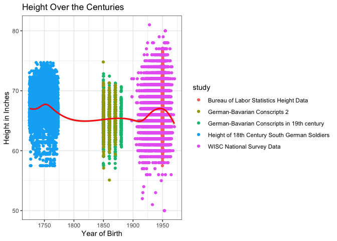

```r
library(tidyverse)
```

```
## ── Attaching packages ─────────────────────────────────────── tidyverse 1.3.1 ──
```

```
## ✓ ggplot2 3.3.3     ✓ purrr   0.3.4
## ✓ tibble  3.1.2     ✓ dplyr   1.0.6
## ✓ tidyr   1.1.3     ✓ stringr 1.4.0
## ✓ readr   1.4.0     ✓ forcats 0.5.1
```

```
## ── Conflicts ────────────────────────────────────────── tidyverse_conflicts() ──
## x dplyr::filter() masks stats::filter()
## x dplyr::lag()    masks stats::lag()
```

```r
library(haven)
library(readr)
library(foreign)
library(readxl)
library(viridis)
```

```
## Loading required package: viridisLite
```

```r
library(hrbrthemes)
```

```
## NOTE: Either Arial Narrow or Roboto Condensed fonts are required to use these themes.
```

```
##       Please use hrbrthemes::import_roboto_condensed() to install Roboto Condensed and
```

```
##       if Arial Narrow is not on your system, please see https://bit.ly/arialnarrow
```

```r
library(ggridges)
library(ggplot2)
```


```r
#Load the data
#1
data_dta1 <- read_dta("https://byuistats.github.io/M335/data/heights/germanconscr.dta")

#2
data_dta2 <- read_dta("https://byuistats.github.io/M335/data/heights/germanprison.dta")

#3
temp <- tempfile()
download.file("https://byuistats.github.io/M335/data/heights/Heights_south-east.zip",
         temp, mode = "wb")
unzip(temp, exdir = "week_04/cs_04/dbf")
data_dbf <- read.dbf("week_04/cs_04/dbf/B6090.DBF")

#4
data_csv <- read_csv("https://github.com/hadley/r4ds/raw/master/data/heights.csv")
```

```
## 
## ── Column specification ────────────────────────────────────────────────────────
## cols(
##   earn = col_double(),
##   height = col_double(),
##   sex = col_character(),
##   ed = col_double(),
##   age = col_double(),
##   race = col_character()
## )
```

```r
#5
data_sav <- read_sav("http://www.ssc.wisc.edu/nsfh/wave3/NSFH3%20Apr%202005%20release/main05022005.sav")
```


```r
# 5 datasets
# Get Birth year, Inches, Centimeters


data1 <- data_dta1 %>%
  mutate(birth_year = bdec, height.cm = height, height.in = (height/2.54), 
         study = 'German-Bavarian Conscripts in 19th century') %>%
  select(birth_year, height.in, height.cm, study)

data2 <- data_dta2 %>%
  mutate(birth_year = bdec, height.cm = height, height.in = (height/2.54),
         study = 'German-Bavarian Conscripts 2') %>%
  mutate(across(height.in, round, 1)) %>%
  select(birth_year, height.in, height.cm, study)

data3 <- data_dbf %>%
  mutate(birth_year = GEBJ, height.cm = CMETER, height.in = CMETER/2.54,
         study = "Height of 18th Century South German Soldiers") %>% 
  mutate(across(height.in, round, 1)) %>% 
  mutate(across(height.cm, round, 0)) %>% 
  select(birth_year, height.in, height.cm, study)


data4 <- data_csv %>%
  mutate(birth_year = 1950, height.in = height, height.cm = (height*2.54),
         study = "Bureau of Labor Statistics Height Data") %>% 
  mutate(across(height.in, round, 1)) %>% 
  mutate(across(height.cm, round, 0)) %>% 
  select(birth_year, height.in, height.cm, study)

data5 <- data_sav %>%
  filter(RT216F > 0 & RT216F < 7, RT216I > -1 & RT216I < 12) %>% 
  mutate(birth_year = (1900 + DOBY),
         height.in = (RT216F * 12 + RT216I),
         height.cm = (height.in*2.54),
         study = "WISC National Survey Data") %>% 
  mutate(across(height.cm, round, 0)) %>% 
  select(birth_year, height.in, height.cm, study)

# combine datasets and filter out NA rows

all_data <- bind_rows(data1, data2, data3, data4, data5) %>%
  filter(!is.na(birth_year), !is.na(height.in), !is.na(height.cm))
```

### First part will show individual heights and be faceted by study.


```r
a <- ggplot(all_data, aes(x = birth_year , y = height.in, color = study)) +
  geom_jitter(size = 0.75) +
  theme_bw() +
  facet_wrap(~study, nrow = 5) +
  scale_x_discrete(limits = seq(1725, 1975, by=25)) +
  coord_cartesian(xlim=c(1700, 2000)) +
  labs(x = "Birth Year", y = "Height (in inches)",
       title = "Comparison of Height Quartiles over Centuries") 
```

```
## Warning: Continuous limits supplied to discrete scale.
## Did you mean `limits = factor(...)` or `scale_*_continuous()`?
```

```r
a
```

<!-- -->

```r
b <- ggplot(all_data, aes(x = birth_year , y = height.cm, fill = study)) +
  geom_violin(size = 0.75) +
  theme_bw() +
  facet_grid(~ factor(study)) +
  scale_x_discrete(limits = seq(1725, 1975, by=25)) +
  coord_cartesian(xlim=c(1700, 2000)) +
  labs(x = "Birth Year", y = "Height (in cm)",
       title = "Comparison of Height Quartiles over Centuries") 
```

```
## Warning: Continuous limits supplied to discrete scale.
## Did you mean `limits = factor(...)` or `scale_*_continuous()`?
```

```r
b
```

<!-- -->

### Second part will prove the assumption of "humans have been getting taller over the years."

#### Based on the graph, the assumption of the average human height has been increasing over the years was not fulfilled. The height data changed slightly over the years which make the number of the hight stayed about the same.


```r
all_data %>%
  ggplot() +
  geom_jitter(mapping=aes(x=birth_year,y=height.in,color=study))+
  geom_smooth(mapping=aes(x=birth_year, y=height.in),color="Red")+
  scale_x_continuous(breaks = c(1750,1800,1850, 1900,1950))+
  theme_bw()+
  labs(x="Year of Birth", y="Height in Inches")+
  ggtitle("Height Over the Centuries")
```

```
## `geom_smooth()` using method = 'gam' and formula 'y ~ s(x, bs = "cs")'
```

<!-- -->
