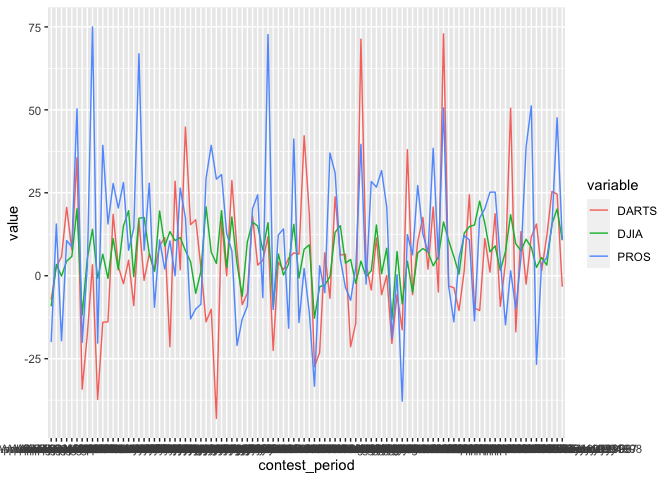
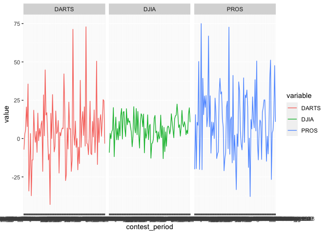

# Original Chart 

#### It looks bad becasue all the lines are overlaping each other

```r
# read the file
stock <- read_rds(url("https://github.com/byuistats/data/blob/master/Dart_Expert_Dow_6month_anova/Dart_Expert_Dow_6month_anova.RDS?raw=true"))

# create a time series plot that shows the six-month returns (y-axis) across time (x-axis) for PROS, DARTS, and DJIA

ggplot(stock, aes(x = contest_period, y = value))+
  geom_line(mapping = aes(group = variable, color = variable)) 
```

<!-- -->
### Used facet_wrap to make it look a little bit better


```r
ggplot(stock, aes(x = contest_period, y = value))+
  geom_line(mapping = aes(group = variable, color = variable)) +
  facet_wrap(~variable)
```

<!-- -->

# Tidy Data


```r
# 1. Use the contestant_period column to create new month_end and year_end columns. (Try using separate() and/or extract() from tidyr.)

# 2. outputs a tibble of the DJIA returns that matches (as closely as possible) the table shown below (aka, “pivot wider” the data)

table <- stock %>%
  separate(contest_period, into = c("start", "end"), sep = "-") %>%
  separate(end, into = c("Month", "year_end"), sep = -4) %>%
  filter(variable == "DJIA") %>%
  select(Month, year_end, value) %>%
  pivot_wider(names_from = year_end, values_from = value) %>%
  arrange(factor(Month, levels = month.name)) 

pander(table)
```


----------------------------------------------------------------------------
   Month     1990    1991   1992   1993   1994   1995   1996   1997   1998  
----------- ------- ------ ------ ------ ------ ------ ------ ------ -------
  January     NA     -0.8   6.5    -0.8   11.2   1.8     15    19.6   -0.3  

 February     NA      11    8.6    2.5    5.5     NA    15.6   20.1   10.7  

   March      NA     15.8   7.2     9     1.6    7.3    18.4   9.6     7.6  

   April      NA     16.2   10.6   5.8    0.5    12.8   14.8   15.3   22.5  

    May       NA     17.3   17.6   6.7    1.3    19.5    9     13.3   10.6  

   June       2.5    17.7   3.6    7.7    -6.2    16    10.2   16.2    15   

   July      11.5    7.6    4.2    3.7    -5.3   19.6   1.3    20.8    7.1  

  August     -2.3    4.4    -0.3   7.3    1.5    15.3   0.6    8.3    -13.1 

 September   -9.2    3.4    -0.1   5.2    4.4     14    5.8    20.2   -11.8 

  October    -8.5    4.4     -5    5.7    6.9    8.2    7.2     3      NA   

 November    -12.8   -3.3   -2.8   4.9    -0.3   13.1   15.1   3.8     NA   

 December    -9.3    6.6    0.2     NA    3.6    9.3    15.5   -0.7    NA   

   Dec.       NA      NA     NA     8      NA     NA     NA     NA     NA   

  Febuary     NA      NA     NA     NA     NA    3.2     NA     NA     NA   
----------------------------------------------------------------------------

```r
# options(knitr.kable.NA = "-")
# kable(stock)
```


