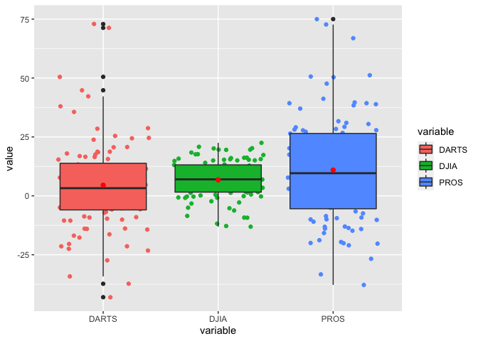

```r
library(tidyverse)
```

```
## ── Attaching packages ─────────────────────────────────────── tidyverse 1.3.1 ──
```

```
## ✓ ggplot2 3.3.3     ✓ purrr   0.3.4
## ✓ tibble  3.1.2     ✓ dplyr   1.0.6
## ✓ tidyr   1.1.3     ✓ stringr 1.4.0
## ✓ readr   1.4.0     ✓ forcats 0.5.1
```

```
## ── Conflicts ────────────────────────────────────────── tidyverse_conflicts() ──
## x dplyr::filter() masks stats::filter()
## x dplyr::lag()    masks stats::lag()
```

```r
library(readr)
library(haven)
library(readxl)
library(downloader)
```

# 1. Load the data

Source: [Github](https://github.com/byuistats/data/tree/master/Dart_Expert_Dow_6month_anova)


```r
data_rds <- read_rds(url("https://github.com/byuistats/data/blob/master/Dart_Expert_Dow_6month_anova/Dart_Expert_Dow_6month_anova.RDS?raw=true"))
View(data_rds)

data_csv <- read_csv("https://raw.githubusercontent.com/byuistats/data/master/Dart_Expert_Dow_6month_anova/Dart_Expert_Dow_6month_anova.csv")
```

```
## 
## ── Column specification ────────────────────────────────────────────────────────
## cols(
##   contest_period = col_character(),
##   variable = col_character(),
##   value = col_double()
## )
```

```r
View(data_csv)

data_dta <- read_dta("https://github.com/byuistats/data/blob/master/Dart_Expert_Dow_6month_anova/Dart_Expert_Dow_6month_anova.dta?raw=true")
View(data_dta)

data_sav <- read_sav("https://github.com/byuistats/data/blob/master/Dart_Expert_Dow_6month_anova/Dart_Expert_Dow_6month_anova.sav?raw=true")
View(data_sav)

# Hint: The function read_xlsx() cannot read files from the web path. Instead, use the library(downloader) R package and use the download(mode = "wb") function to download the xlsx data to your computer. (Use the tempfile() function to automatically generate a file path for you.) Then read the xlsx file from your computer.

temp <- tempfile()
download("https://github.com/byuistats/data/blob/master/Dart_Expert_Dow_6month_anova/Dart_Expert_Dow_6month_anova.xlsx?raw=true",
         temp,
         mode = "wb")
data_xlsx <- read_xlsx(temp)
View(data_xlsx)
```


# 2. Check all five files you have imported into R are the same 

#### 1. Test with all.equal()

```r
all.equal(data_rds, data_csv)
```

```
## [1] "Attributes: < Component \"class\": Lengths (3, 4) differ (string compare on first 3) >"
## [2] "Attributes: < Component \"class\": 3 string mismatches >"                              
## [3] "Attributes: < Component \"spec\": Length mismatch: comparison on first 2 components >"
```

```r
all.equal(data_csv, data_dta)
```

```
## [1] "Attributes: < Length mismatch: comparison on first 2 components >"                     
## [2] "Attributes: < Component \"class\": Lengths (4, 3) differ (string compare on first 3) >"
## [3] "Attributes: < Component \"class\": 3 string mismatches >"                              
## [4] "Component \"contest_period\": Attributes: < target is NULL, current is list >"         
## [5] "Component \"variable\": Attributes: < target is NULL, current is list >"               
## [6] "Component \"value\": Attributes: < target is NULL, current is list >"
```

```r
all.equal(data_dta, data_sav)
```

```
## [1] "Component \"contest_period\": Attributes: < Names: 1 string mismatch >"      
## [2] "Component \"contest_period\": Attributes: < Component 1: 1 string mismatch >"
## [3] "Component \"variable\": Attributes: < Names: 1 string mismatch >"            
## [4] "Component \"variable\": Attributes: < Component 1: 1 string mismatch >"      
## [5] "Component \"value\": Attributes: < Names: 1 string mismatch >"               
## [6] "Component \"value\": Attributes: < Component 1: 1 string mismatch >"
```

```r
all.equal(data_sav, data_xlsx)
```

```
##  [1] "Component \"contest_period\": Attributes: < Modes: list, NULL >"                   
##  [2] "Component \"contest_period\": Attributes: < Lengths: 1, 0 >"                       
##  [3] "Component \"contest_period\": Attributes: < names for target but not for current >"
##  [4] "Component \"contest_period\": Attributes: < current is not list-like >"            
##  [5] "Component \"variable\": Attributes: < Modes: list, NULL >"                         
##  [6] "Component \"variable\": Attributes: < Lengths: 1, 0 >"                             
##  [7] "Component \"variable\": Attributes: < names for target but not for current >"      
##  [8] "Component \"variable\": Attributes: < current is not list-like >"                  
##  [9] "Component \"value\": Attributes: < Modes: list, NULL >"                            
## [10] "Component \"value\": Attributes: < Lengths: 1, 0 >"                                
## [11] "Component \"value\": Attributes: < names for target but not for current >"         
## [12] "Component \"value\": Attributes: < current is not list-like >"
```

#### 2. Test with check.attributes = FALSE

```r
all.equal(data_rds, data_csv, check.attributes = FALSE)
```

```
## [1] TRUE
```

```r
all.equal(data_csv, data_dta, check.attributes = FALSE)
```

```
## [1] TRUE
```

```r
all.equal(data_dta, data_sav, check.attributes = FALSE)
```

```
## [1] TRUE
```

```r
all.equal(data_sav, data_xlsx, check.attributes = FALSE)
```

```
## [1] TRUE
```

# 3. Show the performance of the Dart, DJIA, and Pro stock selections 

```r
stock_data_cvs <- data_csv %>%
  separate(contest_period, sep = '-', into = c('month_start', 'month_end')) %>%
  separate(month_end, sep = -4, into = c('Month', 'Year'))

# 
stock_data_cvs %>%
  ggplot(aes(x = variable, y = value, fill = variable)) +
  geom_jitter(aes(x = variable, y = value, color = variable)) +
  geom_boxplot() +
  stat_summary(fun.y=mean, geom="point", shape=20, size=3, color="red", fill="red")
```

```
## Warning: `fun.y` is deprecated. Use `fun` instead.
```

<!-- -->
