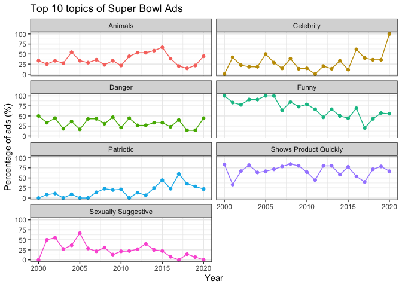

```r
# Import the data

youtube <- readr::read_csv('https://raw.githubusercontent.com/rfordatascience/tidytuesday/master/data/2021/2021-03-02/youtube.csv')
```

```
## 
## ── Column specification ────────────────────────────────────────────────────────
## cols(
##   .default = col_character(),
##   year = col_double(),
##   funny = col_logical(),
##   show_product_quickly = col_logical(),
##   patriotic = col_logical(),
##   celebrity = col_logical(),
##   danger = col_logical(),
##   animals = col_logical(),
##   use_sex = col_logical(),
##   view_count = col_double(),
##   like_count = col_double(),
##   dislike_count = col_double(),
##   favorite_count = col_double(),
##   comment_count = col_double(),
##   published_at = col_datetime(format = ""),
##   category_id = col_double()
## )
## ℹ Use `spec()` for the full column specifications.
```

# Introduction
#### The intent of Tidy Tuesday is to provide a safe and supportive forum for individuals to practice their wrangling and data visualization skills independent of drawing conclusions. While we understand that the two are related, the focus of this practice is purely on building skills with real-world data."

[more](https://github.com/rfordatascience/tidytuesday)

## Data Wrangling

#### Fix the data and use pivot_longer to get the the catagory column

```r
# clean the data

data <- youtube %>%
  distinct() %>% 
  filter(!is.na(id)) %>% 
  pivot_longer(cols = funny:use_sex,
               names_to = "category",
               values_to = "is_category") %>% 
  select(year, id, category, is_category) %>% 
  group_by(year) %>% 
  mutate(total_commercials = n_distinct(id)) %>% 
  group_by(year, category) %>% 
  mutate(total_category = sum(is_category)) %>% 
  distinct(year, category, total_commercials, total_category) %>% 
  mutate(prop_category = total_category / total_commercials)
```

## Data Visualization

```r
facet_names <- c(`animals` = "Animals",
                 `celebrity` = "Celebrity",
                 `danger` = "Danger",
                 `funny` = "Funny",
                 `patriotic` = "Patriotic",
                 `show_product_quickly` = "Shows Product Quickly",
                 `use_sex` = "Sexually Suggestive"
                 )

data %>%
  ggplot(aes(x = year, y = (prop_category*100)), color = category) +
  geom_point(aes(color = category)) +
  geom_line(aes(color = category)) +
  theme_bw()+
  theme(legend.position = "none") +
  facet_wrap(~ category, nrow = 5, labeller = as_labeller(facet_names)) +
  labs(x = "Year",
       y = "Percentage of ads (%)", 
       color = "Category", 
       title = "Top 10 topics of Super Bowl Ads")
```

<!-- -->

