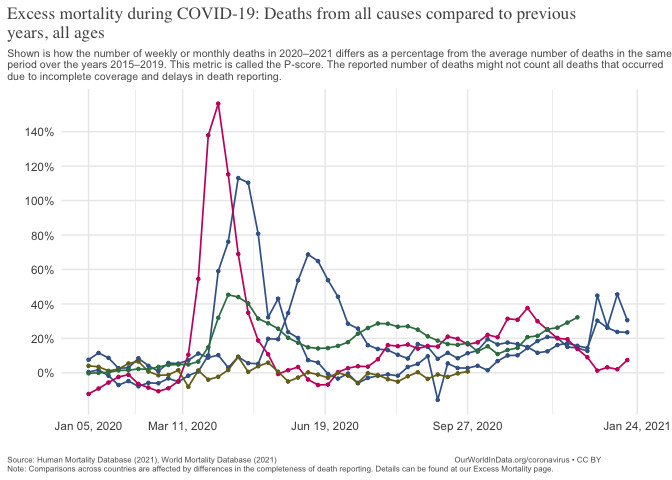
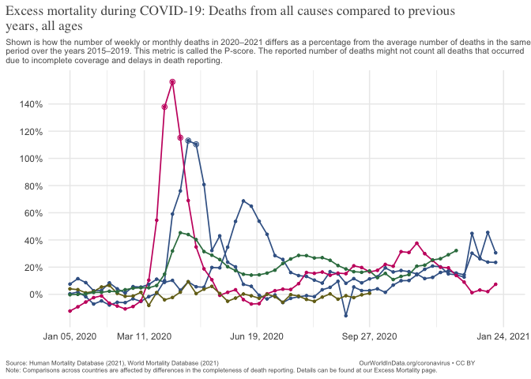
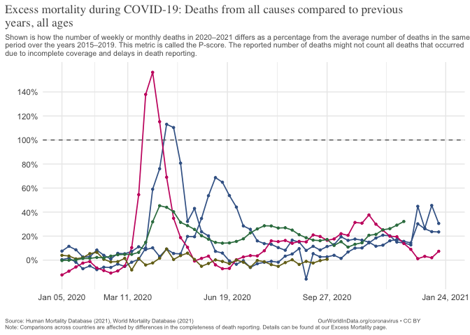
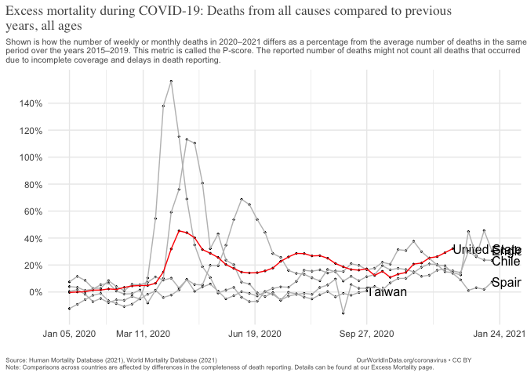

```r
# import the data
data <- read_csv("https://github.com/ktoutloud/classslides/raw/master/math335/data/M335_excess-mortality-p-scores.csv")
```

```
## 
## ── Column specification ────────────────────────────────────────────────────────
## cols(
##   .default = col_double(),
##   date = col_date(format = "")
## )
## ℹ Use `spec()` for the full column specifications.
```

```r
# filter the data
data2 <- data %>% 
  mutate(Spain = (Spain * 100)) %>% 
  pivot_longer(-c('date'), names_to = "country", values_to = "pscore") %>% 
  filter(country %in% c("Chile", "England & Wales", "United States", "Spain", "Taiwan"))
```

### Recreate the graph

### Base Chart


```r
chart1 <- ggplot(data2, aes(x = date, y = pscore, color = country)) +
  theme_minimal() +
  geom_line(size = 0.60) +
  geom_point(size = 0.90) +
  scale_y_continuous(breaks = seq(0,140,20), 
                     minor_breaks = NULL, 
                     labels = function(x)paste0(x,"%")) +
  scale_x_date(breaks = as.Date(c("2020-01-05",
                                  "2020-03-11",
                                  "2020-06-19",
                                  '2020-09-27',
                                  "2021-01-24")),
               date_labels = "%b %d, %Y") +
  labs(x ="", y="",
       title = "Excess mortality during COVID-19: Deaths from all causes compared to previous \nyears, all ages",
       subtitle = "Shown is how the number of weekly or monthly deaths in 2020–2021 differs as a percentage from the average number of deaths in the same \nperiod over the years 2015–2019. This metric is called the P-score. The reported number of deaths might not count all deaths that occurred \ndue to incomplete coverage and delays in death reporting.",
       caption = "Source: Human Mortality Database (2021), World Mortality Database (2021)                                                                                OurWorldInData.org/coronavirus • CC BY \nNote: Comparisons across countries are affected by differences in the completeness of death reporting. Details can be found at our Excess Mortality page.") +
  scale_colour_manual(values = c("Chile" = "#3E6394",
                                 "England & Wales" = "#3E6394",
                                 "United States" = "#367C4F",
                                 "Spain" = "#C91F6E",
                                 "Taiwan" = "#756F1C")) +
  theme(legend.position = "none",
        plot.title = element_text(hjust = 0, size = 13, family = "serif", color = "#555555"),
        plot.subtitle = element_text(hjust = 0, size = 8, color = "#5C5C5C"),
        plot.caption = element_text(hjust = 0, size = 6, color = "#5C5C5C"),
        plot.title.position =  "plot",
        plot.caption.position =  "plot")


chart1
```

```
## Warning: Removed 26 row(s) containing missing values (geom_path).
```

```
## Warning: Removed 26 rows containing missing values (geom_point).
```

<!-- -->


```r
chart2 <- ggplot(data2, aes(x = date, y = pscore, group = country)) +
  theme_minimal() +
  #geom_line(size = 0.60) +
  geom_point(size = 0.40) +
  scale_y_continuous(breaks = seq(0,140,20), 
                     minor_breaks = NULL, 
                     labels = function(x)paste0(x,"%")) +
  scale_x_date(breaks = as.Date(c("2020-01-05",
                                  "2020-03-11",
                                  "2020-06-19",
                                  '2020-09-27',
                                  "2021-01-24")),
               date_labels = "%b %d, %Y") +
   geom_dl(aes(label = country),
          method = list(dl.combine('last.points')),
          cex = 0.7,
          position = 'dodge')+
  labs(x ="", y="",
       title = "Excess mortality during COVID-19: Deaths from all causes compared to previous \nyears, all ages",
       subtitle = "Shown is how the number of weekly or monthly deaths in 2020–2021 differs as a percentage from the average number of deaths in the same \nperiod over the years 2015–2019. This metric is called the P-score. The reported number of deaths might not count all deaths that occurred \ndue to incomplete coverage and delays in death reporting.",
       caption = "Source: Human Mortality Database (2021), World Mortality Database (2021)                                                                                OurWorldInData.org/coronavirus • CC BY \nNote: Comparisons across countries are affected by differences in the completeness of death reporting. Details can be found at our Excess Mortality page.") +
  scale_colour_manual(values = c("Chile" = "#3E6394",
                                 "England & Wales" = "#3E6394",
                                 "United States" = "#367C4F",
                                 "Spain" = "#C91F6E",
                                 "Taiwan" = "#756F1C")) +
  theme(legend.position = "none",
        plot.title = element_text(hjust = 0, size = 13, family = "serif", color = "#555555"),
        plot.subtitle = element_text(hjust = 0, size = 8, color = "#5C5C5C"),
        plot.caption = element_text(hjust = 0, size = 6, color = "#5C5C5C"),
        plot.title.position =  "plot",
        plot.caption.position =  "plot")


chart2
```

```
## Warning: Width not defined. Set with `position_dodge(width = ?)`
```

```
## Warning: Removed 26 rows containing missing values (geom_point).
```

```
## Warning: Removed 26 rows containing missing values (geom_dl).
```

<!-- -->


## Suppose we wanted to highlight (draw attention to) any points that are above 100%. Here are three more graphs that show three different ways to highlight these points.


### Chart 2

#### This chart points out the points when mortality were over 100 %

```r
data3 <- data2 %>%
  filter(pscore > 100)
  
chart1 +
  geom_point(data = data3, mapping = aes(x = date, y = pscore), size = 2, shape = 1)
```

```
## Warning: Removed 26 row(s) containing missing values (geom_path).
```

```
## Warning: Removed 26 rows containing missing values (geom_point).
```

<!-- -->

### Chart 3
#### This chart has a dash line to date show of the points where the dates that mortality were over 100%

```r
chart1 +
  geom_hline(yintercept = 100, linetype = "dashed", color = "#616161")
```

```
## Warning: Removed 26 row(s) containing missing values (geom_path).
```

```
## Warning: Removed 26 rows containing missing values (geom_point).
```

<!-- -->

### Chart 4
#### This chart has lables the date of the points where the dates that mortality were over 100%

```r
chart1 +
  geom_label_repel(aes(label = as.character(date)), data = data3)
```

```
## Warning: Removed 26 row(s) containing missing values (geom_path).
```

```
## Warning: Removed 26 rows containing missing values (geom_point).
```

<!-- -->


## These two graphs showing two different methods to highlight the United States data.


### Chart 5

#### This graph has a different shpae on all the points for USA. 

```r
data4 <- data2 %>%
  filter(country == 'United States')

chart1 +
  geom_point(data = data4, size = 3, shape = 25)
```

```
## Warning: Removed 26 row(s) containing missing values (geom_path).
```

```
## Warning: Removed 26 rows containing missing values (geom_point).
```

```
## Warning: Removed 6 rows containing missing values (geom_point).
```

<!-- -->

### Chart 6
#### This graph shows the red line for the USA and grey lines for other country. It is very clear to focus on the red line when other lines are the same light color.

```r
data5 <- data2 %>%
  filter(country != 'United States')

chart2 +
  geom_line(data = data5, aes(group = country), color = 'grey') +
  geom_line(data = data4, aes(group = country), color = 'red') 
```

```
## Warning: Width not defined. Set with `position_dodge(width = ?)`
```

```
## Warning: Removed 26 rows containing missing values (geom_point).
```

```
## Warning: Removed 26 rows containing missing values (geom_dl).
```

```
## Warning: Removed 20 row(s) containing missing values (geom_path).
```

```
## Warning: Removed 6 row(s) containing missing values (geom_path).
```

<!-- -->
