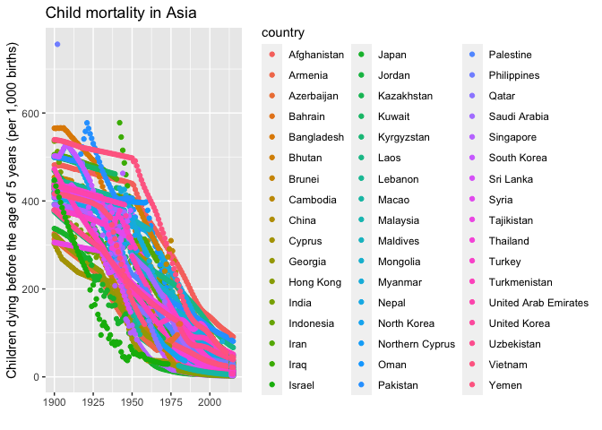
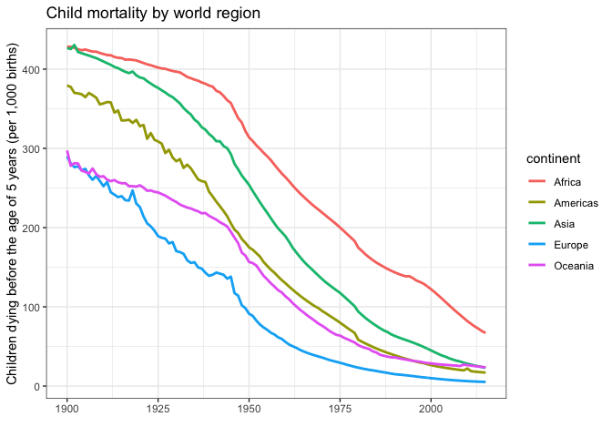
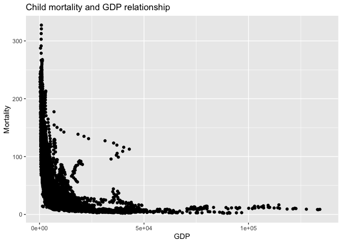
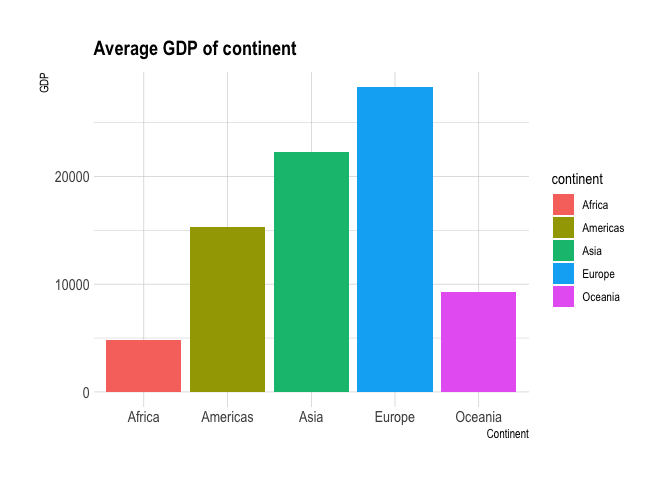

## Exploratory Data Analysis

```r
data <- child_mortality


data %>%
  filter(year >= 1900, continent == 'Asia' ) %>%
  group_by(country, year) %>%
  ggplot(aes(x = year, y = child_mort)) +
  geom_point(aes(color = country)) +
  labs(
      title = "Child mortality in Asia",
      x = "",
      y = "Children dying before the age of 5 years (per 1,000 births)"
    )
```

```
## Warning: Removed 102 rows containing missing values (geom_point).
```

<!-- -->

```r
data %>% 
  filter(year >= 1900 & !is.na(continent)) %>%
  group_by(continent, year) %>% 
  summarise(child_mort = mean(child_mort, na.rm = TRUE)) %>% 
  ggplot(aes(x = year, y = child_mort, color = continent)) +
    geom_line(size = 1) +
    theme_bw() +
    labs(
      title = "Child mortality by world region",
      x = "",
      y = "Children dying before the age of 5 years (per 1,000 births)"
    )
```

```
## `summarise()` has grouped output by 'continent'. You can override using the `.groups` argument.
```

<!-- -->

```r
data2 <- financing_healthcare %>%
  filter( year >= 1990 & !is.na(gdp)) %>%
  select(c(year, continent, country, child_mort, gdp)) %>%
  group_by(continent) 

ggplot(data = data2) +
  geom_point(aes(x = gdp, y = child_mort)) +
  labs(
      title = "Child mortality and GDP relationship",
      x = "GDP",
      y = "Mortality"
    )
```

```
## Warning: Removed 1172 rows containing missing values (geom_point).
```

<!-- -->

## Visualization For Presentation 

```r
data3 <- financing_healthcare %>%
  filter( year >= 1999 & !is.na(gdp) & !is.na(continent)) %>%
  select(c(year, continent, country, health_exp_total, child_mort, gdp)) %>%
  group_by(continent) %>% 
  mutate(child_mort = child_mort / 10) %>% 
  summarise(avgGdp = mean(gdp, na.rm = TRUE)) 


p <- data3 %>%
  ggplot(aes(x = continent, y = avgGdp), fill = continent) +
    # facet_wrap(vars(continent)) +
    geom_col(aes(fill = continent)) +
    theme_ipsum() +
    theme(
      plot.title = element_text(size=15)
    ) +
    labs(
      title = "Average GDP of continent",
      x = "Continent",
      y = "GDP"
    )

p
```

<!-- -->

