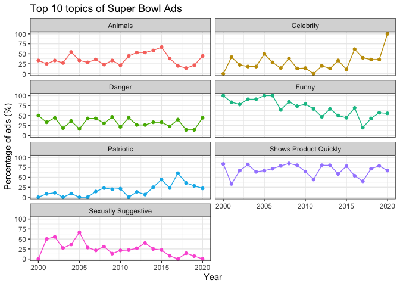

## Instructions

* Search for a #TidyTuesday visualization you admire. You also need to find the source code for the visualization. 
  -If you'd like to use the Superbowl data, try using this twitter search. (Links to an external site.)
* Copy the code for the visualization, and get it to run on your computer.
* Now go through the code, one line at a time, and figure out what everything does. Write comments in the code to explain each step.
  -The visualization code and your code comments need to be included in your task report.


```r
# import all data
youtube <- readr::read_csv('https://raw.githubusercontent.com/rfordatascience/tidytuesday/master/data/2021/2021-03-02/youtube.csv')
```

## Charts and Analysis

### [Source](https://hardin47.github.io/TidyTuesday/2021-03-02/superbowl.html)

### Data Wrangling


```r
# create the data
yt_table <- youtube %>%
  # use mutate to makes new columns 
  mutate(Funny = ifelse(funny, "funny", "not funny"),
         Animals = ifelse(animals, "animals", "no animals"),
         Sex = ifelse(use_sex, "uses sex", "no sex"),
         Patriotic = ifelse(patriotic, "patriotic", "not patriotic"),
         Celebrity = ifelse(celebrity, "celebrity", "no celebrity"),
         Danger = ifelse(danger, "dangerous", "not dangerous"),
         Product = ifelse(show_product_quickly, "quick product view", "delayed product view"),
         # makes a new brand column 
         Brand = brand) %>%
  # selects the columns just created above
  select(Brand, Funny, Animals, Sex, Patriotic, Celebrity, Danger, Product) %>%
  # use table() to put the data into a table
  table()
# pivoting longer
data <- reshape2::melt(yt_table)
# uses 1-7 columns to make the diagram
data <- gather_set_data(data, 1:7)
```


## SKill Review

* Look over case studies and pick one that you want to focus.
  - I would like to focus on Case Study 5 
* Ask yourself: Which one did you struggle the most with? WHat skills do you want to practice?
* Write down at least three questions you have
  - WHat are the differences between facet wrap, facet_wrap, group and summarize?
  - How do you know a good way to order the ggplot?
  - Can we compare two differnt values in one chart? like the GDP and mortality rate


```r
data <- youtube %>%
  distinct() %>% 
  filter(!is.na(id)) %>% 
  pivot_longer(cols = funny:use_sex,
               names_to = "category",
               values_to = "is_category") %>% 
  select(year, id, category, is_category) %>% 
  group_by(year) %>% 
  mutate(total_commercials = n_distinct(id)) %>% 
  group_by(year, category) %>% 
  mutate(total_category = sum(is_category)) %>% 
  distinct(year, category, total_commercials, total_category) %>% 
  mutate(prop_category = total_category / total_commercials)

facet_names <- c(`animals` = "Animals",
                 `celebrity` = "Celebrity",
                 `danger` = "Danger",
                 `funny` = "Funny",
                 `patriotic` = "Patriotic",
                 `show_product_quickly` = "Shows Product Quickly",
                 `use_sex` = "Sexually Suggestive"
                 )

data %>%
  ggplot(aes(x = year, y = (prop_category*100)), color = category) +
  geom_point(aes(color = category)) +
  geom_line(aes(color = category)) +
  theme_bw()+
  theme(legend.position = "none") +
  facet_wrap(~ category, nrow = 5, labeller = as_labeller(facet_names)) +
  labs(x = "Year",
       y = "Percentage of ads (%)", 
       color = "Category", 
       title = "Top 10 topics of Super Bowl Ads")
```

<!-- -->


