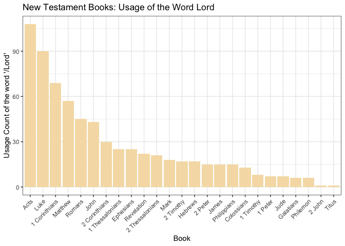

```r
# import the data
new_testament <- readRDS(url("https://github.com/ktoutloud/classslides/raw/master/math335/data/scriptures/nt.rds"))
```

## Data Wrangling

```r
count <- function(df){
  df %>%
    mutate(lord = sum(str_count(scripture_text, "Lord")))
}


new_testament_count_loard <- new_testament %>%
  map(count) %>%
  bind_rows(.id = "id") %>%
  group_by(book_title) %>%
  distinct(book_title, .keep_all = TRUE) %>%
  select(book_title, lord) %>%
  filter(lord > 0) %>% 
  arrange(desc(lord))
```

## Data Visualization

```r
new_testament_count_loard %>%
  ggplot(aes(x = reorder(book_title, -lord),
             y = lord)) +
  geom_col(fill = "wheat") +
  theme_bw() +
  labs(title = "New Testament Books: Usage of the Word Lord",
       x = "Book",
       y = "Usage Count of the word '/Lord'") +
  theme(legend.position = "none",
        axis.text.x = element_text(angle = 45, vjust = 1, hjust = 1))
```

<!-- -->

## Summary
I was surprise that the word 'Lord' would be used the most in the first four books, but it was in the book of Acts. The most usage count in Acts is more than 90 times, which is very close to 100. On the other hand, 2 John and Titus only have a few count of the word 'Lord'. 
