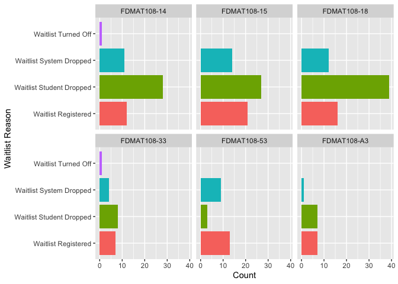

## Data Wrangling

### Background
Have you ever been on a waitlist for a class? It can be pretty nerve racking, especially if all your other classes and your work schedule depend on getting into that particular class in that particular time slot.

I obtained transactional data from the registration system for Math108 (Math in the Real World) sections I taught in Fall2016, Winter2017, and Fall2017. I wanted to do some analysis to help waitlisted students better understand their chances of getting in. To simplify this task, we will only look at 1 section: FDMAT108-18.

### Function 1

```r
# import the data
data <- read_csv("https://byuistats.github.io/M335/data/waitlist_DP_108.csv")
#View(data_csv)

# filter the dataset to include only students from section FDMAT108-18
waitlist <- data %>% 
  mutate(date = lubridate::mdy_hm(`Registration Date`)) %>% 
  filter(`Course Sec` == "FDMAT108-18")
#View(waitlist)


# function 1: calculates the % of currently registered students who were at one time on the wait list.

function_1 <- function(df)
{
  #get the current status
  current_status <- df %>%
  arrange(`Person ID`, date) %>%
            group_by(`Person ID`) %>%
            slice_tail() %>%
            ungroup() %>%
            select(`Person ID`, date, Status, `Waitlist Reason`)
  
  n_current_registered <- sum(current_status$Status == "Registered")
  n_registered_from_waitlist <- sum(current_status$`Waitlist Reason` == "Waitlist Registered", na.rm = TRUE)
  
  result1 <- ((n_registered_from_waitlist / n_current_registered) * 100)
  return(result1)
  
}

# call the function 1
function_1(waitlist)
```

```
## [1] 21.21212
```

```r
# Result : 21.21212
```

### Function 2

```r
# function 2: calculates the % of students who were ever on the wait list that are currently registered for for the class.

function_2 <- function(df) {
  
  
  current_status <- df %>%
    arrange(`Person ID`, date, Status) %>%
    group_by(`Person ID`) %>%
    slice_tail() %>%
    ungroup() %>%
    select(`Person ID`, date, Status, `Waitlist Reason`)
  
    n_registered_from_waitlist <- sum(current_status$`Waitlist Reason` == "Waitlist Registered", na.rm = TRUE)
    waitlist <- waitlist %>% filter(Status == "Wait List")
    n_waitlisted <- length(unique(waitlist$`Person ID`))
    
    result2 <- ((n_registered_from_waitlist / n_waitlisted) * 100)
  
    return(result2)
}

# call the function
function_2(waitlist)
```

```
## [1] 22.58065
```

```r
# result 22.58065
```

## Data Visualization

### Graph1

```r
ggplot(data %>% drop_na()) +
  facet_wrap(~ `Course Sec`, nrow=2) +
  geom_bar(aes(y = `Waitlist Reason`, fill = `Waitlist Reason`)) +
  theme(legend.position = "none") +
  labs(x = "Count")
```

<!-- -->

## Summary
Based on the graph we can see that more and more students were able to registered overtime.
