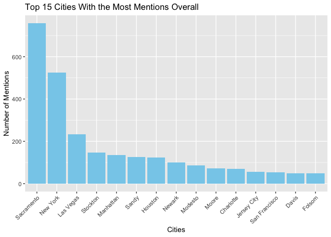
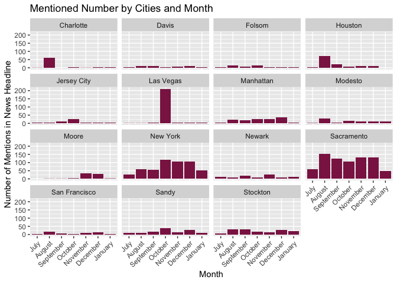
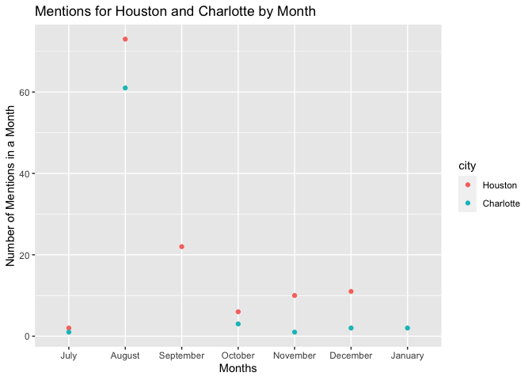

```r
# import the data

abc <- read_csv("https://storybench.org/reinventingtv/abc7ny.csv")

kcra <- read_csv("https://storybench.org/reinventingtv/kcra.csv")
```

# Data Wrangling & Visiualization for questions

```r
abc %>% 
  mutate(dataset = "abc")
```

```
## # A tibble: 9,745 x 7
##    datetime   headline       url         teaser      feed_name feed_url  dataset
##    <chr>      <chr>          <chr>       <chr>       <chr>     <chr>     <chr>  
##  1 July 18, … 9-year-old bo… http://abc… "Tyler Car… abc7ny.c… http://a… abc    
##  2 July 18, … 10-year-old b… http://abc… "The Coast… abc7ny.c… http://a… abc    
##  3 July 18, … 10-year-old b… http://abc… "A 10-year… abc7ny.c… http://a… abc    
##  4 July 18, … American Airl… http://abc… "Al Blackm… abc7ny.c… http://a… abc    
##  5 July 18, … 12-year-old g… http://abc… "Daphne Yu… abc7ny.c… http://a… abc    
##  6 July 18, … Exclusive: Da… http://abc… "In an exc… abc7ny.c… http://a… abc    
##  7 July 18, … Watch '50Plus… http://abc… "50PlusPri… abc7ny.c… http://a… abc    
##  8 July 18, … 10-year-old b… http://abc… "The incid… abc7ny.c… http://a… abc    
##  9 July 18, … Filmmaker Al … http://abc… "The Maysl… abc7ny.c… http://a… abc    
## 10 July 18, … The Trend: Th… http://abc… "David Nov… abc7ny.c… http://a… abc    
## # … with 9,735 more rows
```

```r
kcra <- kcra %>% 
  mutate(dataset = "kcra")
combine_dat <- bind_rows(abc, kcra)
cities <- us.cities
cities_dat <- cities %>% 
  mutate(city_name = substr(name, 1, nchar(name)-3)) %>% 
  pull(city_name) %>% 
  unique() %>% 
  str_c(collapse = "|")
combine_dat2 <- combine_dat %>% 
  mutate(city = str_extract(headline, cities_dat))
```

# Question1
Q: For the 15 cities with the most mentions overall, create a graphic that summarizes their mentions. Write a paragraph in which you discuss the results. Do they make sense? Do you need to make changes? If something looks wrong, fix your code and run it again to find the new top 15.

A: As you can see in the graph, Sacramento and New York that have the most most mentions. Surprisingly, other cites that are bigger or more famous than Sacramento have a lot less mentions.  


```r
# clean the data
question1 <- combine_dat2 %>% 
  select(headline, dataset, city) %>% 
  filter(!is.na(city)) %>% 
  group_by(city) %>% 
  mutate(n_mentions = n()) %>%
  distinct(n_mentions) %>% 
  arrange(desc(n_mentions)) %>% 
  head(15)

# plot the data
graph1 <- question1 %>% 
  ggplot() +
  geom_col(aes(x = reorder(city, -n_mentions), y = n_mentions), fill = "skyblue") +
  labs(x = "Cities",
       y = "Number of Mentions", 
       title = "Top 15 Cities With the Most Mentions Overall") +
  theme(legend.position = "none",
        axis.text.x = element_text(angle = 45, vjust = 1, hjust = 1))

graph1
```

<!-- -->

# Question2
Q: For those same 15 cities, create a graphic to show the headline count for each city for each month. Write a paragraph to discuss meaningful insights from the graph about headlines over time for certain cities and/or other features and trends you notice in the graph.

A: Sacramento didn't get the attention for a specific month, instead, it was mentioned constantly each month. On the other hand, Vegas was mentioned a good amount of times in just one month.


```r
# clean the data
question2 <- combine_dat2 %>% 
  select(datetime, headline, dataset, city) %>% 
  filter(!is.na(city)) %>% 
  group_by(city) %>% 
  mutate(n_mentions = n()) %>%
  ungroup() %>% 
  mutate(date = str_replace(datetime," at", ""),
        date = str_replace(date, "AM|PM", ""),
        date = str_replace(date, "[:graph:]{5}$", ""), 
        date = str_replace(date, "[:space:]+$", "")) %>%
  separate(col = date, into = c('month','year'), sep = "\\d{2},") %>% 
  mutate(month = str_replace(month, "[:space:]", "")) %>% 
  group_by(city, month) %>% 
  mutate(n_mentions_month = n()) %>% 
  ungroup() %>% 
  select(city, month, n_mentions, n_mentions_month) %>% 
  mutate(month = factor(month, levels = c("July", "August", "September", "October", "November", "December", "January"))) %>% 
  arrange(desc(n_mentions)) %>% 
  unique() %>% 
  head(102)

# plot the data
graph2 <- question2 %>%
  ggplot() +
  geom_col(aes(x = month, y = n_mentions_month), fill = "violetred4") +
  facet_wrap(~ city) +
  labs(x = "Month", 
       y = "Number of Mentions in News Headline",
       title = "Mentioned Number by Cities and Month") +
  theme(legend.position = "none",
        axis.text.x = element_text(angle = 45, vjust = 1, hjust = 1))
  

graph2
```

<!-- -->

# Question3
Q: Create a graphic specifically dedicated to comparing the headlines generated about Houston, TX and Charlotte, NC over time (by month). What trends do you notice?

A: Based on this graph, we can see that August seems to be the month for a lot of mentions for both Huston and Charlotte.And Houston has more news stories than Charlotte from July to December, 2018.

```r
# clean the data
question3 <- question2 %>% 
  mutate(month = factor(month, levels = c("July", "August", "September", "October", "November", "December", "January")),
         city = factor(city, levels = c("Houston", "Charlotte"))) %>% 
  drop_na()

# plot the data
graph3 <- question3 %>% 
  ggplot(aes(x = month, y = n_mentions_month)) +
  geom_point(aes(color = city)) +
  labs(x = "Months",
       y = "Number of Mentions in a Month", 
       title = "Mentions for Houston and Charlotte by Month")

graph3
```

<!-- -->


