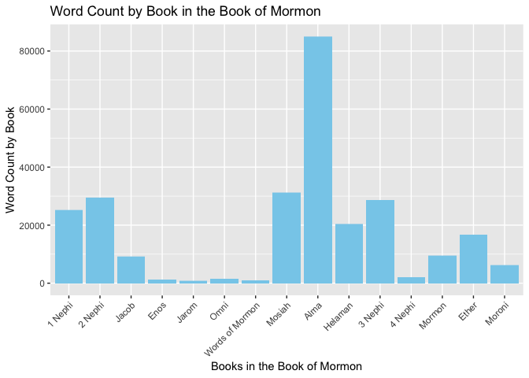

# Question1

```r
question1 <- scripture_data %>% 
  filter(volume_title %in% c("New Testament", "Book of Mormon")) %>% 
  mutate(word_count = str_count(scripture_text,"\\S+")) %>% 
  group_by(volume_title) %>% 
  summarise(ave_verse_length = mean(word_count))

question1
```

```
## # A tibble: 2 x 2
##   volume_title   ave_verse_length
##   <chr>                     <dbl>
## 1 Book of Mormon             40.4
## 2 New Testament              22.7
```

# Question2

```r
question2 <- scripture_data %>% 
  filter(volume_title %in% c("New Testament", "Book of Mormon")) %>% 
  mutate(word_count = str_count(scripture_text,"\\S+"),
         Jesus_count = str_count(scripture_text, "Jesus")) %>% 
  group_by(volume_title) %>% 
  summarise(total_Jesus = sum(Jesus_count))

question2
```

```
## # A tibble: 2 x 2
##   volume_title   total_Jesus
##   <chr>                <int>
## 1 Book of Mormon         184
## 2 New Testament          976
```
# Question3

```r
question3 <- scripture_data %>% 
  filter(volume_title %in% "Book of Mormon") %>% 
  mutate(word_count = str_count(scripture_text,"\\S+"))
question3 %>% 
  ggplot() +
  geom_col(aes(x = reorder(x = book_title, book_id), y = word_count), fill = "skyblue") +
  labs(x = "Books in the Book of Mormon",
       y = "Word Count by Book",
       title = "Word Count by Book in the Book of Mormon") +
  theme(legend.position = "none",
        axis.text.x = element_text(angle = 45, vjust = 1, hjust = 1))
```

<!-- -->

```r
question3 
```

```
## # A tibble: 6,604 x 20
##    volume_id book_id chapter_id verse_id volume_title   book_title
##        <dbl>   <dbl>      <dbl>    <dbl> <chr>          <chr>     
##  1         3      67       1190    31103 Book of Mormon 1 Nephi   
##  2         3      67       1190    31104 Book of Mormon 1 Nephi   
##  3         3      67       1190    31105 Book of Mormon 1 Nephi   
##  4         3      67       1190    31106 Book of Mormon 1 Nephi   
##  5         3      67       1190    31107 Book of Mormon 1 Nephi   
##  6         3      67       1190    31108 Book of Mormon 1 Nephi   
##  7         3      67       1190    31109 Book of Mormon 1 Nephi   
##  8         3      67       1190    31110 Book of Mormon 1 Nephi   
##  9         3      67       1190    31111 Book of Mormon 1 Nephi   
## 10         3      67       1190    31112 Book of Mormon 1 Nephi   
## # … with 6,594 more rows, and 14 more variables: volume_long_title <chr>,
## #   book_long_title <chr>, volume_subtitle <chr>, book_subtitle <chr>,
## #   volume_short_title <chr>, book_short_title <chr>, volume_lds_url <chr>,
## #   book_lds_url <chr>, chapter_number <dbl>, verse_number <dbl>,
## #   scripture_text <chr>, verse_title <chr>, verse_short_title <chr>,
## #   word_count <int>
```

# Summary

It is clear that it has the most words among other books. It didn't surprise me but it is very interesting to see all the words count in the book of Mormon. 

