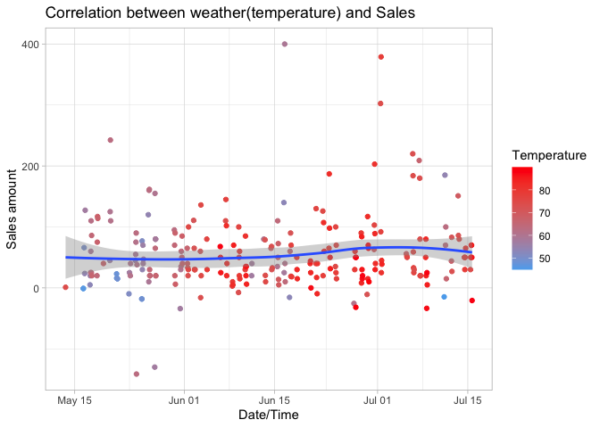

# Import the data

```r
data <- read_csv("https://byuistats.github.io/M335/data/carwash.csv")

view(data)
```
<!-- [ ] Read in the car wash data https://byuistats.github.io/M335/data/carwash.csv and format it for the needs of this task -->
<!-- [ ] Convert the times from UTC time to mountain time using the right function out of library(lubridate). -->
<!-- [ ] Create a new hourly grouping variable using ceiling_date() from library(lubridate) -->
<!-- [ ] Aggregate the point of sale data into hour sales totals -->
<!-- [ ] Use riem_measures(station = "RXE", date_start = , date_end = ) for station RXE from library(riem) to get the matching temperatures -->
<!-- [ ] Create a new hourly variable that matches your car wash hourly variable -->
<!-- [ ] Merge the two datasets together -->
<!-- [ ] Create a visualization that provides insight into the relationship between sales and temperature by hour of the day -->


# Data Wrangling

```r
# Car wash data 
carwash <- data %>% 
  mutate(time = with_tz(time, "MST")) %>% 
  mutate(hourly = ceiling_date(time, "hour")) %>% 
  group_by(hourly) %>% 
  summarize(hour_total_sale = sum(amount))

#view(carwash)

# Weather data

temperatures <- riem_measures(station = "RXE", 
              date_start = as_date(min(carwash$hourly)), 
              date_end = as_date(max(carwash$hourly)))

temp <- temperatures %>% 
  select(valid, tmpf) %>% 
  drop_na() %>% 
  mutate(valid = ceiling_date(with_tz(valid, "MST"), "hour"))


# Merge two datasets

all_data <- left_join(carwash, temp, by = c("hourly" = "valid")) %>%
  drop_na()

view(all_data)
```

# Data Visualization


```r
all_data %>%
  ggplot( aes(x = hourly, y = hour_total_sale, color = tmpf)) +
  geom_point() +
  geom_smooth() +
  scale_color_gradient(name = "Temperature", low = "steelblue2", high = "red") +
  labs(x = "Date/Time", y = "Sales amount", color = "Temp (F)",
       title = "Correlation between weather(temperature) and Sales") +
  theme_light()
```

<!-- -->

# Summary
There are more revenue on Jun 15 and July 1 st, but overall sales revenue are evenly distributed from May to July.
