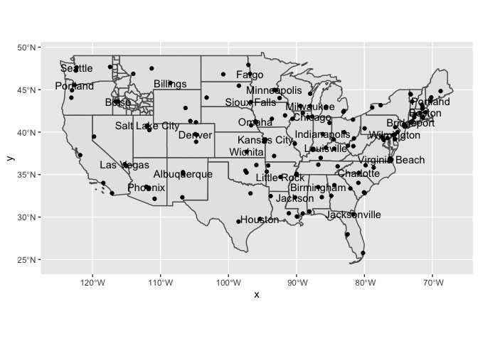

```r
states <- us_states()

cities <- us_cities()

id <- us_counties(states = 'Idaho')
```

# Data Wrangling

```r
# wrangling the data
top_cities <- cities %>% 
  group_by(state_name) %>% 
  slice_max(order_by = `population`, n = 3) %>% 
  mutate(pop_per_1000 = round(`population` / 1000, 0)) %>% 
  filter(!state_abbr %in% c("AK", "HI", "DC"))

#View(top_cities)

largest_cities <- top_cities %>% 
  group_by(state_name) %>% 
  slice_max(order_by = `population`, n = 1) 

#View(largest_cities)


states_48 <- states %>% 
  filter(!name %in% c("Alaska", "Hawaii", "Puerto Rico"))
#View(states_48)
```


# Data Visualization 

```r
ggplot() +
  geom_sf(data = states_48) +
  geom_sf(data = id) +
  geom_sf(data = top_cities) +
  geom_sf_text(data = largest_cities, aes(label = city), check_overlap = TRUE)
```

<!-- -->
