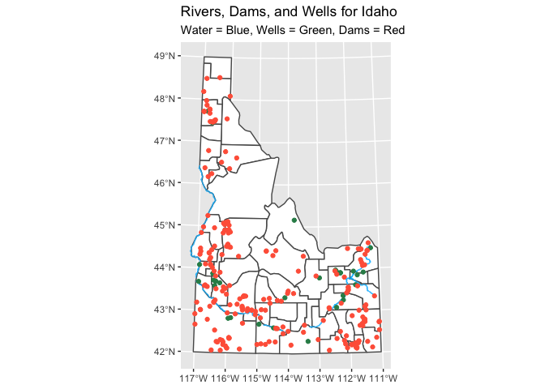

### We have been asked by the state of Idaho to visualize permitted well locations with a production of more than 5000 gallons and the spatial relationship of the large wells to the locations of large dams (surface area larger than 50 acres). They have provided a a shp file (Links to an external site.) for us and given us a web address for the well (Links to an external site.), dam (Links to an external site.), and water (Links to an external site.) locations. They would like to have the Snake River and Henrys Fork rivers plotted.

### Their US map is projected to show the entire US. You will need to subset the data to Idaho and then reproject the map, so Idaho is not tilted.

# Data Wrangling

```r
map <- st_read("~/Desktop/shp/County-AK-HI-Moved-USA-Map.shp")
```

```
## Reading layer `County-AK-HI-Moved-USA-Map' from data source 
##   `/Users/chloehuang/Desktop/shp/County-AK-HI-Moved-USA-Map.shp' 
##   using driver `ESRI Shapefile'
## Simple feature collection with 3115 features and 15 fields
## Geometry type: MULTIPOLYGON
## Dimension:     XY
## Bounding box:  xmin: -2573301 ymin: -1889441 xmax: 2256474 ymax: 1565782
## Projected CRS: Albers
```

```r
wells <- st_read("~/Desktop/Wells/Wells.shp")
```

```
## Reading layer `Wells' from data source `/Users/chloehuang/Desktop/Wells/Wells.shp' using driver `ESRI Shapefile'
## Simple feature collection with 187995 features and 33 fields
## Geometry type: POINT
## Dimension:     XY
## Bounding box:  xmin: -117.3642 ymin: 41.02696 xmax: -111.0131 ymax: 49.00021
## Geodetic CRS:  WGS 84
```

```r
dams <- st_read("~/Desktop/Dams_of_Idaho/Dams_of_Idaho.shp")
```

```
## Reading layer `Dams_of_Idaho' from data source 
##   `/Users/chloehuang/Desktop/Dams_of_Idaho/Dams_of_Idaho.shp' 
##   using driver `ESRI Shapefile'
## Simple feature collection with 1170 features and 23 fields
## Geometry type: POINT
## Dimension:     XY
## Bounding box:  xmin: -117.0866 ymin: 42.00059 xmax: -111.0725 ymax: 48.95204
## Geodetic CRS:  WGS 84
```

```r
water <- st_read("~/Desktop/hyd250/hyd250.shp")
```

```
## Reading layer `hyd250' from data source 
##   `/Users/chloehuang/Desktop/hyd250/hyd250.shp' using driver `ESRI Shapefile'
## Simple feature collection with 30050 features and 26 fields
## Geometry type: LINESTRING
## Dimension:     XY
## Bounding box:  xmin: 2241685 ymin: 1198722 xmax: 2743850 ymax: 1981814
## Projected CRS: NAD83 / Idaho Transverse Mercator
```

```r
projection <- state_plane(state ="ID")

map <- map %>%
  filter(StateName == "Idaho") %>%
  st_transform(projection)

water <- water %>%
  filter(FEAT_NAME %in% c("Snake River", "Henrys Fork")) %>%
  st_transform(projection)

wells <- wells %>%
  filter(Production > 5000) %>% 
  st_transform(projection)

dams <- dams %>%
  filter(SurfaceAre > 50) %>%
  st_transform(projection)
```

# Data Visualization

```r
ggplot() +
  geom_sf(data = map, fill = "white") +
  geom_sf(data = water, color = "deepskyblue") +
  geom_sf(data = wells, color = "seagreen") +
  geom_sf(data = dams, color = "tomato1") +
  labs(title = "Rivers, Dams, and Wells for Idaho", subtitle = "Water = Blue, Wells = Green, Dams = Red")
```

<!-- -->

```r
ggsave("Water_Flow_Idaho.png")
```
